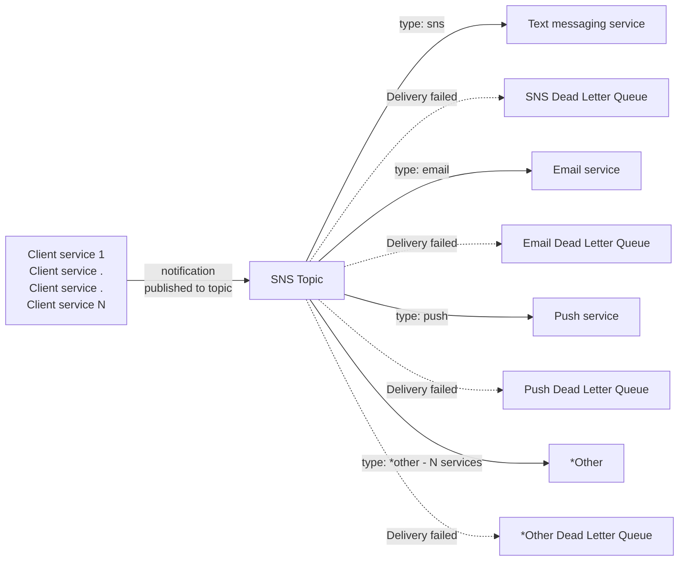
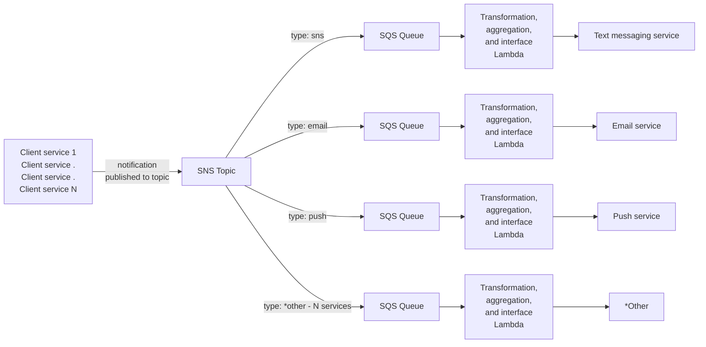

# Serverless Guru Project

Hello!

This project serves as a home for this work.

### Objective:

Design a "Notification Platform" that enables multiple services to send notifications to
end-users through various channels such as Email, SMS, and Push Notifications.
The system should be designed primarily for deployment on AWS Cloud.

### Requirements (summarized):
1) Diagram the system
2) Highly available
3) High message rates
4) Secure (and explain how)
5) Authentication and Authorization
6) Observable (explain how to monitor and how to debug)
7) Multi-channel - aka system is for multiple forms of notification
8) Explain How to add new services
9) Document this all (which is what this README aims to do)

## Simple implementation 
### Functional diagram


AWS Simple Notification Service does the bulk of the work here.

It's features include:
1) Highly available within a region
2) Durable messages within a region
3) High capacity*

* - See consideration #4

Any of the upstream client systems will publish a notification to the SNS Topic, using the message schema, 
which will ensure all needed data makes it to the actual downstream notification channels.

Downstream notification channels are all subscribed to the Topic with a filter for their specific type of notification.

#### Notification Schema:
The schema should be as simple as possible.

```
{ "recipient_id:" : "String"
  "message": "String",
  "type": "[SMS, EMAIL, PUSH, *(other supported services)"
  "sender_id": "String"
  "metadata": "String"
```
recipient id:  
Identifier for whom should receive this message.  This could be a single identifying string. 
A downstream service would either use this string directly, ie its an email address, phone number, or device ID.
It could also be a collection of strings, if the down stream service is able to notify multiple identities from a single message.
The limitations here depend on the capabilities of downstream services, this can be reduced to single identity if this is not possible.
As is currently designed the limitations of any one downstream service inform the limitations of this service for all.

It could also be a customer ID and down stream systems are responsible for the lookup of pertinent customer contact info on their end.

The metadata field can be used to unambiguously communicate what the type of the recipient id is.

message:  
As this use case is about human facing notifications, the message should most likely be a string value. 
SNS supports UTF8 encoded strings, which hopefully suffice for this purpose.

type:  
Type is used to do determine the fanout path, so it must be one of configured values or it will just end up in the dead letter queue.

sender id:
Similar properties to the recipient id.  Not likely to need multi-identity for sender.

metadata:  
This is a catch-all, a JSON-string encoded map could be passed to provide additional contextual information.

One potential use case is to send a filename of a template, which should be used with this message to deliver it as an email.  
Rather than having to encode the full content of an email message into this message.  

As noted above this could be used to clarify the type of ID used as recipient ID.  

For the most part, it is here to provide a mechanism for additional data that may be needed without having to rearchitect the entire system.


#### Observability:
1) The SNS Topic publishes cloud watch metrics for success and failure that should be observed
2) The depth of the Dead Letter Queues is a strong negative indicator of system performance
3) X-ray tracing would be of great value in observing that the system works and to show system performance


#### Security:
1) SNS Topic should be encrypted using KMS. (encryption-at-rest)
2) Secure transport should be required on all communication. (encryption-in-flight)
3) Dead Letter Queues should also be encrypted using at KMS.


#### Authentication and Authorization:
AWS IAM provides all the authentication and authorization.

1) On the identity side, only Principals with permission to call "sns:Publish" can publish to the notification topic.  
2) On the Topic side, the resource policy should be restricted to only those principles that we want to allow to publish notifications.  
3) The SQS queues have resource policies restricted so that only the SNS Service Principal can publish to them.  
   Permission for reading and consuming messages can be added as needed by a person doing debug work.
4) Downstream services are subscribed, the entity doing the subscribing should be restricted on the resource side to 
   known principals that exist for that purpose, potentially the Cloud Formation service principal, if subscriptions will be created via Infrastructure as Code.


#### Considerations:  
1) SNS standard topics attempt to deliver AT LEAST once.  If redundant delivery is problematic, the topic can be upgraded to a FIFO topic which has "Only Once" delivery. 
2) Capacity varies by region, us-east-1 can handle 30,000 messages a second.  Many regions only support 300 messages/second.  Message publishing is throttled above the numbers.
3) SNS notification maximum size is 256KB, that is message data and all metadata inclusive
4) Email seems a potential candidate for going oversize.  If message size gets close to 256KB, then only the pertinent part of the message should be queued and it should be put into a template by the end service.
5) Logging is inconsistent.  Logging can be configured for certain types of delivery, the native SNS and SMS deliveries are not supported for logging.
"Other" systems may be able to have optional logging turned on for them.
Technically there may be things you could infer from CloudTrail logs, but in my experience if you are looking at CloudTrail for operational purposes, that's a red flag.
6) This has very few parts and as such does a fair bit to minimize costs
7) There may be concerns about traffic spikes hitting the downstream channel services and not having the capacity to deal with the volume of messages
8) Interface between the SNS topic and the downstream services requires that downstream services be able to subscribe to the topic and respond to Publish events.


## More Complex implementation
### Functional diagram


This design introduces the idea of running a lambda to provide data transformations and aggregation as well as to
support arbitrary interface for a downstream system.

Nothing requires that every notification channel receive this change, it could be done on a channel by channel basis where desired or needed.

This addition to the design provides a number of benefits:
1) The queue can protect against traffic spikes overwhelming down stream systems
2) Messages can be enriched or transformed with additional customer data
3) Messages can be read in batches and aggregated to reduce the number of API calls to down stream systems
4) Messages can be opportunistically deduplicated (but this should not be relied on for systems that are sensitive to duplicate messages)
5) Messages can be thrown away for any sort of business logic reason, like to recent of a notification for the same reason
6) The lambda code can interface with arbitrary interfaces and enable communication to services that are not setup to subscirber to a Pub/Sub.

#### Security:
The same AuthN and AuthZ concerns between components exist.  
Resource policies should constrain authorization to the relevant upstream and downstream entities.
Identity policies should be scoped to the minimal viable permissions.
Encrypt all data at rest using KMS, require secure transport between services

#### Cost:
There are quite a few more moving parts in this design which will raise the cost of operation.

#### Observability:
X-ray traces continue to have value as it traces through the lambda and into properly instrumented code.
Lambdas can log meaningful messages about the data they are processing.
Monitoring queue depth and lambda invocation rates, error rates, and success rates will provide a good picture of the systems health and performance.
